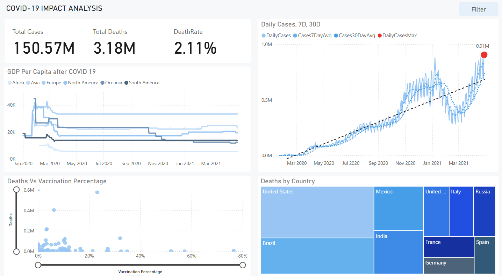

# COVID-19 Data Exploration

This analysis aims to explore key COVID-19 metrics, including mortality rates, infection rates, GDP per capita, and vaccination percentages, using the provided datasets. By examining these factors, we seek to identify trends, correlations, and disparities in the global pandemic response.Through this analysis, we aim to get data-driven insights that highlight the critical role of vaccinations, economic factors, and healthcare interventions in managing the pandemic.

## Overview

This project explores COVID-19 data through structured queries and analysis to:

- Track global and regional infection trends.
- Understand mortality and recovery rates.
- Analyze vaccination progress.
- Evaluate the economic state of the countries before and after the pandemic.

## Data Source
The data used in this project is sourced from publicly available COVID-19 datasets, including:

- [Our World in Data (OWID)](https://ourworldindata.org/coronavirus-data)
- [Johns Hopkins University COVID-19 Dataset](https://github.com/CSSEGISandData/COVID-19)

## Results and Insights

### Mortality and Infections Rates
- COVID-19 had a 2.11% fatality rate, with 150.57M cases and 3.18M deaths, highlighting the global severity of the pandemic.
- Countries like Yemen and Sudan had high mortality rates, likely due to weaker healthcare systems. Mexico's high rate (9.25%) suggests challenges in early case detection and treatment.
- European microstates (Andorra, San Marino) had the highest infection rates due to small populations and high population density.

### Daily Cases Trend
- The data shows multiple waves of infection, with significant spikes in mid-2020, late 2020, and early 2021. Early 2021 experienced a sharp peak, with daily cases reaching approximately 910,000. This represents one of the highest recorded surges.
- At the beginning of the pandemic, daily case counts started off slowly, reflecting the initial spread and under-detection due to limited testing. Early interventions like travel restrictions and localized lockdowns likely contributed to this slow rise.
- The recurring high daily case counts, particularly during peak periods, underline the pressure on healthcare systems and the importance of preparedness and resource allocation.

### Impact on the Global Economy
- There is a clear decline in GDP per capita in early 2020, which corresponds to the initial global lockdowns.
- Some regions, like North America and Europe, appear to have had a slight recovery by early 2021, while others, such as Africa and South America, remained lower.
- This suggests that wealthier regions may have had stronger economic resilience or recovery efforts.

### Vaccinations
- Approximately 35–40%, suggesting that, on average, around one-third to two-fifths of the populations in the dataset received at least one vaccine dose.
- A few countries have reached very high vaccination levels (often above 50–60%), while many nations, especially in lower-income regions, remain below 20–30%.
- Lower vaccination rates (0–20%) correlate with higher death concentrations, while rates above 40% are linked to significant fatality reductions, underscoring the effectiveness of mass vaccination.

## Technologies Used

- **Excel**: For data cleaning and transformations.
- **SQL**: Data exploration and creating views which were helpful in visualizing specific metrics.
- **BI Tools**: Power BI for visualization.

### Author

Developed by [Varun Pravesh](https://github.com/varunpravesh).

